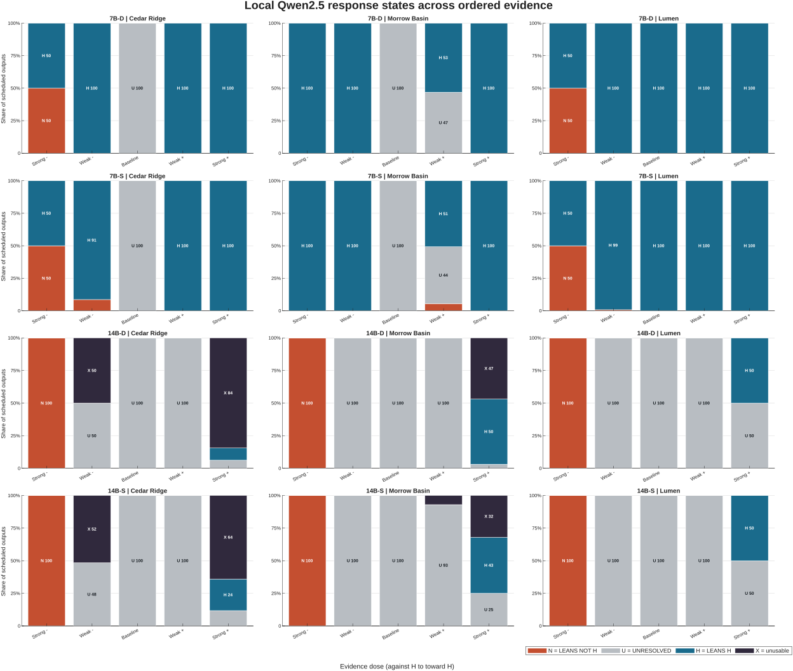
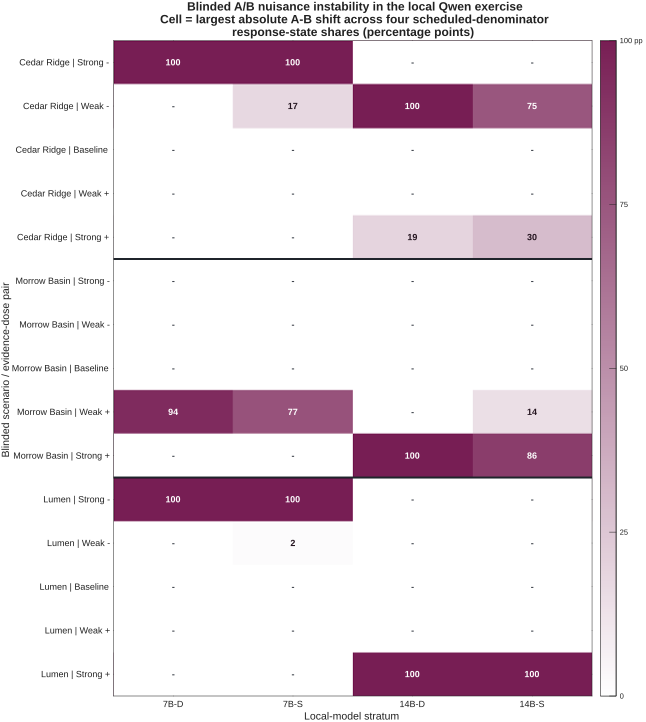

# Parallax

## Stress-testing strategic AI advice without an answer key

When a policymaker asks whether to reassure an ally, escalate, or wait, there
may be no objective label against which to score an AI answer. Parallax asks a
narrower behavioral question: **as controlled evidence moves from strongly
against to strongly toward a hypothesis, does the model's stated assessment
move too—and does it stay stable when only decision-irrelevant wording
changes?**

[Read the live research story](https://parallax.midex.app/) ·
[Open the Situation Room](https://parallax.midex.app/situation-room/) ·
[Executive summary](executive-summary.md) ·
[Readable proposal](proposal/) ·
[Raw proposal](submission-aug23/proposal-final.md)

## Situation Room

The judge-facing [Situation Room](situation-room/) publishes the five frozen
SR-11R1 public-safe artifacts byte-for-byte. It presents the governing
1,600-row SR-8R1 local campaign, including 777 transport-unavailable rows kept
on the denominator. The earlier 4,800-row Qwen2.5 campaign remains available
as non-governing predecessor evidence; it is not substituted for SR-8R1.

The frozen module retains its historical `PRIVATE CANDIDATE`, `no publication
authority`, and `noindex,nofollow` language. Those labels describe its sealed
pre-publication state. The additive [publication receipt](publication/situation-room-v1/)
records the later human authority to publish those exact bytes. Publication is
not ChinaTalk submission and creates no frontier-provider scientific result.

## What happened

Parallax is a three-experiment research lineage, not a single polished result:

1. **Experiment 1 — `NOT_SUPPORTED`.** The first live, two-provider protocol
   made 210 confirmatory calls across three synthetic strategic scenarios.
   Relevant evidence moved three complete units, but a nuisance paraphrase
   moved one, and refusals made observability uneven. The result failed its
   frozen rule and was not rescued post hoc.
2. **Experiment 2 — `INSUFFICIENT_EVIDENCE` for both provider arms.** The live
   successor resolved all 888 planned coordinates with stronger custody, but
   only 66 of 288 matched triples were fully valid. Offline qualification
   established replay and custody; it did not turn the campaign into a
   positive scientific result.
3. **Experiment 3 — mature protocol, provider science unexecuted.** The rebuilt
   instrument uses five evidence doses, records refusal separately, and keeps
   unavailable mass in a joint partial-identification analysis. It survived
   6,674,400 known-ground-truth synthetic checks. Its governing contest-facing
   local evidence is the 1,600-row SR-8R1 two-family campaign; 777 rows were
   transport-unavailable. The separate 4,800-row Qwen2.5 campaign remains
   predecessor stress evidence. The full Claude/Gemini confirmatory study is
   designed but unfunded and has not run.

Detailed public records:

- [Experiment 1](experiments/experiment-1/index.html)
- [Experiment 2](experiments/experiment-2/index.html)
- [Experiment 3](experiments/experiment-3/index.html)
- [Machine-readable research lineage](governance/research-lineage.json)

## What the real local models did

The 4,800-row Qwen2.5 surrogate campaign produced 4,544 valid ordinal
responses and 256 schema-invalid enum values, all in 14B strata. Dose paths
were not uniformly monotone. Seventeen of 60 blinded nuisance pair-by-stratum
comparisons had a nonzero shift. Those are useful failures, not a pass.



*Figure A. Descriptive local Qwen2.5 evidence only. This is not Claude/Gemini
evidence, a confirmatory result, a belief-revision claim, or a mechanism claim.
[Data, MATLAB source, and hashes](figures/README.md).*



*Figure B. Maximum A–B shift across all-scheduled response shares. This is not
a provider equivalence test or a causal model-size/decoding effect.
[Data, MATLAB source, and hashes](figures/README.md).*

## The claim firewall

Parallax currently supports claims about **observable response behavior and
evaluation machinery**. It does not establish:

- hidden belief, truth tracking, reasoning mechanism, or policy correctness;
- general strategic competence;
- that Claude or Gemini passed Experiment 3;
- that local Qwen2.5 behavior represents Chinese models or transfers to
  commercial providers;
- a causal effect of 7B versus 14B capacity;
- that surface-cue concordance identifies an internal mechanism; or
- 95% full-claim joint power from `N=9270`.

See the [claim/evidence matrix](governance/claim-evidence-matrix.csv),
[readable claim-firewall review](governance/claim-firewall/), and
[raw claim-firewall review](governance/claim-firewall-review.md).

## Reproduce the publication

From this directory:

```powershell
python reproducibility/verify_situation_room_publication.py
```

The [readable reproduction guide](reproduce/) and the [full narrative reader](research/narrative/)
explain the same boundary. Their raw sources remain available as
[reproduction Markdown](reproducibility/README.md) and [narrative Markdown](contest-narrative.md).
The Situation Room publication verifier requires no GPU, model weights,
provider credentials, Ollama, network access, funding, or model/provider calls.
It verifies the full successor tree, frozen SR-11R1 hashes, public authority
receipt, internal links, privacy boundary, and publication seal. The original
August-23 verifier remains preserved as predecessor evidence.

## Current status

```text
PUBLICATION = LIVE
EXPERIMENT_1 = NOT_SUPPORTED
EXPERIMENT_2 = INSUFFICIENT_EVIDENCE
EXPERIMENT_3_CONFIRMATORY_EXECUTION = NOT_PERFORMED
SCIENTIFIC_PROVIDER_RESULT = NONE
FULL_CONFIRMATORY_EXECUTION_FUNDING = NOT_SECURED
SITUATION_ROOM_PUBLICATION = AUTHORIZED_AND_LIVE
SR11R1_FROZEN_ARTIFACTS_MUTATED = NO
CONTEST_SUBMISSION = NOT_PERFORMED
NEXT_BOUNDARY = HUMAN_CHINATALK_SUBMISSION_DECISION
```

Contact: [kevinadriancervantes@gmail.com](mailto:kevinadriancervantes@gmail.com) ·
[LinkedIn](https://www.linkedin.com/in/kevinadriancervantes/)

The six Anthropic/Google calls in this release were non-scientific transport
qualification only. Publication does not constitute ChinaTalk submission.
